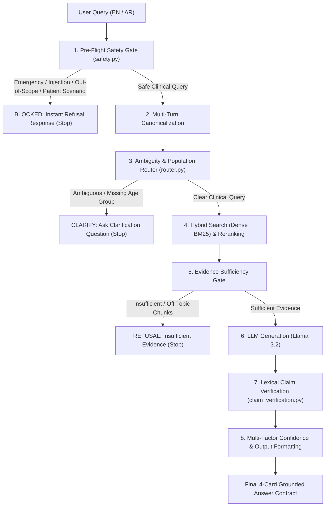

# Project Technology Stack & Architecture Overview

An easy-to-understand, comprehensive breakdown of all technologies, tools, libraries, deployment architecture, and design decisions used in the **Pediatric Asthma Clinical Decision Support (CDS) System** (Day 1 through Day 4).

---

## 🧭 Executive Summary

This project builds a **zero-hallucination, evidence-grounded Clinical Decision Support (CDS) system** for pediatric and adolescent asthma management based on approved guidelines from the **World Health Organization (WHO)** and the **National Institute for Health and Care Excellence (NICE NG245)**.

The system transitions raw clinical PDFs into a production-grade, interactive web application:

```text
PDF Guidelines ➔ Ingestion & Cleaning ➔ Section-Aware Chunking ➔ Hybrid Search (Dense + BM25) 
➔ Cross-Encoder Reranking ➔ Pre-Flight Safety Gate (Emergency/Injection/Scope/Patient Scenario)
➔ Query Router (Ambiguity & Population Context) ➔ Evidence Sufficiency Gate ➔ Grounded Generation (Llama 3.2) 
➔ Lexical Claim Verification ➔ 4-Card Clinical Web Interface (React + Vite)
```

---

## 🛠️ Complete Technology Stack

### 1. Application & Web Interface Layer
| Technology / Component | Stack / Library | Purpose & Rationale |
|---|---|---|
| **Frontend Web UI** | **React 18 + Vite** | High-performance Single Page Application (SPA) providing an interactive 3-tab Clinical Decision Support workspace (`frontend/`). |
| **Styling & Design System** | **Vanilla CSS & TailwindCSS** | Harmonious clinical color scheme (slate, purple, emerald, rose), glassmorphism, responsive dynamic cards, and micro-animations. |
| **Clinical Iconography** | **`lucide-react`** | Standardized medical icons (`Baby`, `Stethoscope`, `ShieldAlert`, `AlertTriangle`, `TrendingUp`). |
| **Backend REST API** | **FastAPI + Uvicorn** | High-concurrency ASGI Python web server (`api.py`) exposing REST endpoints for chat sessions, safety routing, and benchmark evaluation. |
| **Session Persistence** | **SQLite (`sqlite3`)** | Persistent relational store (`src/medical_rag/persistence_store.py`) recording clinical chat histories, user sessions, and evaluation state. |
| **Dev Launcher** | **`dev.py`** | Single-command launcher executing both FastAPI backend (`http://127.0.0.1:8000`) and React Vite server (`http://localhost:5173`) in sub-process. |

---

### 2. Safety, Guardrails & Query Routing Stack
| Component | Implementation | Function & Rationale |
|---|---|---|
| **Pre-Flight Safety Gate** | **`src/medical_rag/safety.py`** | 100% deterministic, sub-millisecond regex engine screening queries **before retrieval or LLM execution**. Priority cascade: `EMERGENCY` $\rightarrow$ `INJECTION` $\rightarrow$ `OUT_OF_SCOPE` $\rightarrow$ `PATIENT_SCENARIO` $\rightarrow$ `PROCEED`. |
| **Query Router** | **`src/medical_rag/router.py`** | Ambiguity & population interceptor. Detects underspecified clinical queries (e.g. asking for treatment without specifying adult vs. pediatric) and asks for age group context before searching. |
| **Evidence Sufficiency Gate** | **`src/medical_rag/generation.py`** | Post-retrieval / pre-generation check ensuring retrieved chunks factually contain the specific query intent (e.g. distinguishing step-by-step inhaler technique from spacer device advice). |
| **Claim-Support Verification** | **`src/medical_rag/claim_verification.py`** | Lexical content-word overlap verifier ($\ge 25\%$ overlap) ensuring generated claims are backed by cited chunk text. Marks citations `VERIFIED` vs `UNVERIFIED`. |
| **Safety Metrics Engine** | **`src/medical_rag/safety_metrics.py`** | Evaluation metrics module calculating Correct Refusal Rate (CRR), False Refusal Rate (FRR), Unsupported Claim Rate (UCR), and Attack Success Rate (ASR). |

---

### 3. RAG Pipeline, Vector Search & AI Models
| Category | Technology / Library | Purpose in Project |
|---|---|---|
| **Runtime & Package Manager** | **Python 3.12** & **`uv`** | High-performance Rust-based Python environment and dependency manager. |
| **PDF Ingestion & Parsing** | **`pypdf` + Custom Cleaning Engine** | Extracts text and physical page numbers while stripping navigation noise and preserving exact dosages (`mg`, `mcg`, `kg`). |
| **Chunking & Indexing** | **SectionAwareChunker** | Splits text at section boundaries (max 700 tokens, 100-token overlap), sanitizing section titles to prevent body text from becoming headers. |
| **Local AI Models (Ollama)** | **Ollama (`0.32.14`)** | Private, on-device local execution for embedding and LLM inference. |
| | **`nomic-embed-text`** | 768-dimensional local text embedding model fine-tuned for semantic retrieval. |
| | **`llama3.2` (3B)** | Open-weights instruction-tuned LLM used strictly for evidence-grounded generation. |
| **Vector Database** | **ChromaDB (`chromadb`)** | Open-source vector database using Cosine Distance indexing for dense semantic search. |
| **Hybrid Search & Reranking** | **`rank-bm25`** | Sparse keyword search engine implementing Okapi BM25 for exact drug names & clinical terms. |
| | **Reciprocal Rank Fusion (RRF)** | Fuses sparse (BM25) and dense (Chroma) search ranks using $RRF(d) = \sum \frac{1}{k + r(d)}$. |
| | **Cross-Encoder Reranker** | Deep transformer model (`sentence-transformers`) for cross-attention candidate reranking. |

---

### 4. Testing & Quality Assurance Stack
| Testing Layer | Framework | Coverage & Details |
|---|---|---|
| **Automated Test Suite** | **`pytest` + `unittest`** | **104 automated test cases** (100% passing) covering ingestion, chunking, hybrid retrieval, reranking, safety, router, grounding, and API lifecycle. |
| **Mandatory Regression Suite** | **`tests/test_safety.py`** | Automated tests for 6 mandatory prompts: `"asthma symptoms"`, `"what are asthma symptoms"`, `"can i eat ice cream"`, `"breast cancer screening info"`, `"i have been coughing all night, might it be asthma?"`, and `"how to use an inhaler"`. |

---

## 📐 Pipeline End-to-End Execution Flow



---

## 🔑 Key Architectural Principles

1. **Deterministic Security First**:  
   Emergency detection, prompt injection defense, out-of-scope pre-filtering, and patient scenario detection occur **before retrieval or LLM execution**. This guarantees sub-millisecond refusal (<1ms), zero token cost, and complete immunity to prompt jailbreaks.

2. **Population Context Enforcement**:  
   Asthma treatment guidelines diverge significantly between children and adults. Intercepting underspecified queries before retrieval prevents adult recommendations from being delivered to pediatric patients.

3. **Multi-Factor Grounding & Citation Verification**:  
   A chunk existing in ChromaDB is not proof of grounding. Every claim sentence is verified against evidence text via lexical-overlap checking before being marked `VERIFIED`.

4. **100% Local Privacy & Offline Capability**:  
   All embeddings, vector searches, reranking models, LLM generation, SQLite storage, and web servers run locally on-device via Ollama, FastAPI, and Vite.
