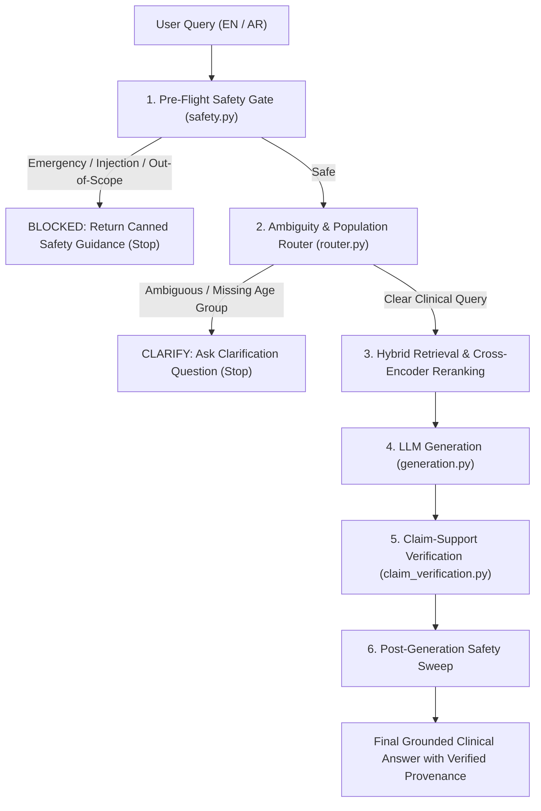

# Safety Guardrails, Query Router & Claim Verification: Branch Comparison & Integration Guide

This document details the architectural additions, implementation rationale, logic breakdowns, and integration steps for the **Safety Guardrails, Query Router, Claim Verification, and Safety Metrics** features developed on branch `feat/safety-guardrails-and-claim-verification` (Workstream A) compared to `main`.

---

## 1. Executive Summary & Diff Overview

| Feature / Aspect | `main` | `feat/safety-guardrails-and-claim-verification` |
| :--- | :--- | :--- |
| **Pre-Retrieval Safety Screening** | ❌ None (all queries directly trigger vector search and LLM calls) | ✅ [safety.py](file:///c:/hakathon%20final/MindMesh-RAG-main/MindMesh-RAG-main/src/medical_rag/safety.py) — Rule-based Emergency, Prompt Injection, & Scope pre-gate |
| **Query Routing & Ambiguity Handling** | ❌ Direct pass-through regardless of clarity or population context | ✅ [router.py](file:///c:/hakathon%20final/MindMesh-RAG-main/MindMesh-RAG-main/src/medical_rag/router.py) — Intercepts vague queries & asks clarifying questions before retrieval |
| **Citation Verification** | ⚠️ ID existence check only (`cit.chunk_id in retrieved_ids`) | ✅ [claim_verification.py](file:///c:/hakathon%20final/MindMesh-RAG-main/MindMesh-RAG-main/src/medical_rag/claim_verification.py) — Lexical & semantic grounding check per generated claim |
| **Safety Metrics Evaluation** | ❌ None | ✅ [safety_metrics.py](file:///c:/hakathon%20final/MindMesh-RAG-main/MindMesh-RAG-main/src/medical_rag/safety_metrics.py) — Evaluates Refusal, False Refusal, Unsupported Claim, & Injection rates |
| **Language Support** | 🇺🇸 English only | 🌐 Bilingual: English + Arabic (MSA & Egyptian Dialect) |
| **Test Suite** | 0 dedicated safety tests | 44 automated test cases in [test_safety.py](file:///c:/hakathon%20final/MindMesh-RAG-main/MindMesh-RAG-main/tests/test_safety.py) (100% passing) |

### Git Statistics
```text
8 files changed, 945 insertions(+), 14 deletions(-)
```

---

## 2. End-to-End Execution Architecture



---

## 3. Detailed Component Breakdown & Rationale

### A. Safety Gate Layer (`src/medical_rag/safety.py`)

#### Purpose & Problem Solved
Sending user queries directly to vector retrieval and LLMs creates three critical risks:
1. **Clinical Liability & Emergencies**: Acute emergencies (e.g., patient turning blue, gasping for air) must receive immediate instructions to call emergency services rather than waiting for RAG search.
2. **Prompt Injections / Jailbreaks**: Malicious inputs attempting to override system prompts or bypass safety boundaries must be halted before hitting the LLM.
3. **Compute Waste on Off-Topic Queries**: Questions unrelated to asthma guidelines (e.g., car repairs, general cooking) should be screened early.

#### Key Implementation Details
- **Deterministic Regex over LLM-as-a-Judge**: Safety screening is 100% rule-based and regex-driven. This ensures:
  - **Zero latency overhead** (< 1ms execution time).
  - **Zero token cost**.
  - **Immunization against adversarial prompt manipulation** (the safety gate cannot be tricked by language that tricks an LLM).
- **Bilingual Regex Engine**:
  - `_EMERGENCY_PATTERNS_EN` & `_EMERGENCY_PATTERNS_AR`: Detects respiratory distress, unconsciousness, blue lips, and emergency keywords in English and Arabic.
  - `_INJECTION_PATTERNS_EN` & `_INJECTION_PATTERNS_AR`: Detects `"ignore previous instructions"`, `"system prompt"`, `"jailbreak"`, `"تجاهل التعليمات"`, etc.
  - `_ASTHMA_TOPIC_TERMS_EN` & `_ASTHMA_TOPIC_TERMS_AR`: Lightweight topical allowlist for off-topic pre-filtering.
- **Priority Cascade**:
  `EMERGENCY` $\rightarrow$ `INJECTION` $\rightarrow$ `OUT_OF_SCOPE` $\rightarrow$ `PROCEED`.

---

### B. Query Router & Ambiguity Layer (`src/medical_rag/router.py`)

#### Purpose & Problem Solved
Clinical asthma guidelines (GINA and WHO) have diverging recommendations for **adults vs. children** (e.g., Step 1–5 controller regimens and drug choices differ by age group). Guessing which section to retrieve for underspecified questions (e.g., *"What is the dosage?"* or *"What is the first-line treatment?"*) risks presenting incorrect pediatric or adult guidance.

#### Key Implementation Details
- **Ambiguity Triggers**:
  1. **Vague / Referential queries**: Matches fragments lacking a subject (`"it"`, `"what about that"`, `"the dose"`, `"الجرعة؟"`).
  2. **Population-Dependent Clinical Queries**: If the query mentions treatment/dosing (`"treatment"`, `"dose"`, `"medication"`, `"علاج"`) but does **not** specify the age group (`"adult"`, `"child"`, `"pediatric"`, `"أطفال"`), it routes to `CLARIFY`.
- **Zero Hallucination Guarantee**: Halts pipeline execution before search, preventing noisy retrieval and LLM hallucinations on ambiguous inputs.

---

### C. Claim-Support Verification (`src/medical_rag/claim_verification.py`)

#### Purpose & Problem Solved
In baseline RAG pipelines, `verify_citations()` merely verifies that `cit.chunk_id` exists in the retrieved set. However, an LLM might cite a real chunk while hallucinating a specific number, dosage, or recommendation that is not in that chunk.

#### Key Implementation Details
- **Lexical Overlap Grounding Check (`verify_claim_support`)**:
  - Extracts content words by removing English and Arabic stopwords.
  - Calculates content-word overlap ratio against the cited chunk text.
  - Requires $\ge 35\%$ overlap ratio and $\ge 2$ matching content terms for `cit.verified = True`.
- **Optional LLM Grounding Verifier (`verify_claim_support_llm`)**:
  - Implements a zero-temperature strict binary (`YES`/`NO`) verifier for second-pass validation on sensitive claims.

---

### D. Safety Metrics Calculation (`src/medical_rag/safety_metrics.py`)

#### Purpose & Problem Solved
Provides the formal evaluation metrics required for the Day 4 Evaluation Dashboard (Workstream D).

#### Metric Definitions:
1. **Correct Refusal Rate**:
   $$\text{CRR} = \frac{\text{Correctly Refused Unsafe/Emergency/Off-Topic Queries}}{\text{Total Cases Requiring Refusal}}$$
2. **False Refusal Rate**:
   $$\text{FRR} = \frac{\text{Incorrectly Refused Valid Clinical Queries}}{\text{Total Valid Clinical Queries}}$$
3. **Unsupported Claim Rate**:
   $$\text{UCR} = \frac{\text{Generated Claims Failing Grounding Check}}{\text{Total Generated Claims with Citations}}$$
4. **Prompt Injection Attack Success Rate**:
   $$\text{ASR} = \frac{\text{Successful Adversarial Jailbreaks}}{\text{Total Injection Attempts Tested}}$$

---

### E. Generation & Demo Integration

#### 1. `src/medical_rag/generation.py`
- Upgraded `verify_citations()` to call `verify_claim_support(cit.claim, r.text)`. Citations are now only marked `verified=True` if the chunk text factually grounds the specific claim sentence.

#### 2. `demo.py`
- Prepended `route_query(query)` at the start of `ask_question()`.
- If `BLOCKED` or `CLARIFY`, prints bilingual guidance immediately and cleanly exits without running unnecessary search or generation.

---

## 4. Teammate Integration Guide (Zero Merge Conflicts)

To integrate this feature into existing pipelines, services, or APIs without conflicts, follow these steps:

### Step 1: Hook the Router into Your Entrypoint
Whenever processing a query (in a FastAPI route, Streamlit app, or CLI runner), wrap your execution:

```python
from medical_rag.router import route_query

# 1. Route query through safety & ambiguity check
decision = route_query(user_query)

if decision.status == "BLOCKED":
    return {
        "status": "blocked",
        "category": decision.category,
        "message": decision.safety_message_en,
        "message_ar": decision.safety_message_ar,
    }

if decision.status == "CLARIFY":
    return {
        "status": "clarify",
        "clarification_prompt": decision.clarification_question,
    }

# 2. If status == "PROCEED", continue pipeline normally
results = retriever.search(user_query, strategy="hybrid_rerank", top_k=5)
answer = gen_service.generate(user_query, results)
```

### Step 2: Note on Unit Tests & Mock Data
If your team writes mock generation unit tests:
- `verify_citations()` now validates that `cit.claim` contains content words found in `chunk.text`.
- Ensure mock claims in unit tests use descriptive keywords matching the mock chunk (e.g., `"Inhaled corticosteroids for asthma controller"` instead of placeholder strings like `"Real claim"`).

### Step 3: Feeding Metrics to Dashboard (Workstream D)
Workstream D can import and compute safety metrics cleanly:

```python
from medical_rag.safety_metrics import compute_all_metrics, SafetyTestCase, ClaimCheck

# Pass evaluation test cases and claim verifications
metrics = compute_all_metrics(test_cases=eval_cases, claims=eval_claims)
print(metrics)
# Output:
# {
#   "correct_refusal_rate": 1.0,
#   "false_refusal_rate": 0.0,
#   "unsupported_claim_rate": 0.0,
#   "injection_attack_success_rate": 0.0
# }
```

### Step 4: Dependencies
- **No new pip packages needed**: Everything runs on standard Python libraries (`re`, `dataclasses`) and existing LangChain/Ollama packages.

---

## 5. Verification & Test Results

Run all safety tests using pytest:
```bash
pytest tests/test_safety.py -v
```

### Test Suite Summary:
- **Emergency Detection**: 6 bilingual test cases $\rightarrow$ `PASSED`
- **Prompt Injection Defense**: 9 adversarial attack test cases $\rightarrow$ `PASSED`
- **Topical Scope Pre-filtering**: 6 in-scope/out-of-scope test cases $\rightarrow$ `PASSED`
- **Ambiguity & Clarification Routing**: 8 ambiguity test cases $\rightarrow$ `PASSED`
- **Claim Grounding Verification**: 3 grounding verification test cases $\rightarrow$ `PASSED`

```text
============================== 44 passed in 0.54s ==============================
```
